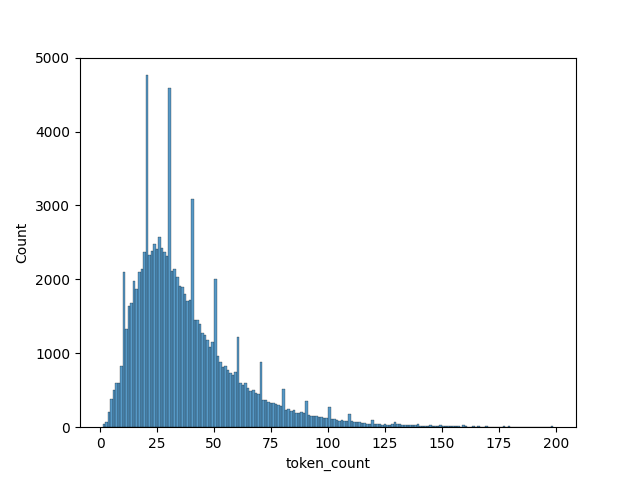

# How to generate a dataset

1. Run generate_formulas.py. 
Each requests return up to 35 formulas. Prompt is randomly generated. One request usually costs 0.25-0.75 cents and takes 30s. I used gpt-3.5-turbo, btw it follows instructions significantly better than chat gpt version. 
You can run this script multiple times with different prompt functions, and process it later. Each run will produce separate directory and an outp.txt file with normalized and splited to tokens unique results of your generation. Each thread writes its generation result into separate file
2. Run concat_outp_files function from process_generated_formulas.py
It will join all outp.txt file into final text file with unique formulas on each line
3. Run generate_images.py
- It will generate 10 folders and each image will be generated in a random one. Idk why but everything slows down a lot when directory accumulates ~5k+ files, so more folders -- less problems. To generate png file, first giant pdf generated with extra trash files, then cropped pdf, then png.
- Then all images need to be moved to a common directory
- Then a csv file (formula | image_path) is created by calculating hashes of formulas and matching them with generated filenames. 
- In the end you can even plot length distribution of you dataset! Those spikes arent duplicates, i checked  

# File structure that these scripts generate

```
data/                   <- folder for generating formulas
├─ concat_outp.txt      <- final generated file: concat all outp.txt files and drop duplicates
├─ article_prompts/
│  ├─ result_1.txt      <- each thread writes raw gpt answers into sepparate file
│  ...
│  ├─ result_16.txt     
│  ├─ outp.txt          <- intermediate result file: process, concat all results, drop duplicates
├─ variable_prompts/
│  ├─ result_1.txt
│  ...
│  ├─ result_16.txt
│  ├─ outp.txt
formula_images_multiple/            <- folder for rendering images
├─ images_0/                        <- each formula png is written into random folder
│  ├─ 0a2a10e946c756e_basic.png     <- images are named with hash of formula
│  ├─ 0a5e84568b734c8_basic.png
│  ...
│  ├─ 0a18b92c0e876e8_basic.png
...
├─ images_10/
│  ├─ 0a642bf7a7df0f0_basic.png
│  ...
│  ├─ 0ab3d70e7fdca28_basic.png
result_images/                      <- final folder with all images
├─ 0a2a10e946c756e_basic.png        <- copied files from images_* folders
...
├─ 0a5e84568b734c8_basic.png
image_formula_mapping.csv           <- file with formulas and corresponding image filenames
```

# Nuances
1. When generating with the same prompt, you will get A LOT of duplicates. With constant prompt 50% of all results were duplicates. Generating interchangable prompts with gpt4 helps. Asking to make prompts that could be found in Astrophisics/Linear Algebra/[other arxiv subsection] helps a lot and reduces duplicates to ~20%. 
2. Also gpt can generate invalid latex that will result in no images. I lost about another 20% from it. Maybe prompt needs to be tuned
3. After generating dataset, you can remove unmatched files with utils.py cleanup_dataset
4. I used code from another similar dataset https://github.com/Miffyli/im2latex-dataset/tree/master/src I used tokenising, normalising, removing invisible chars functions as is. I used function that renders formula to png, but simplified it. This functions are in formula2image: original is formula_to_image, mine is formula_to_image_simplified.
5. On mac m1 generation of 125k unique formulas took ~3h. Rendering images took ~5h. In total I've spent 20$ on api 